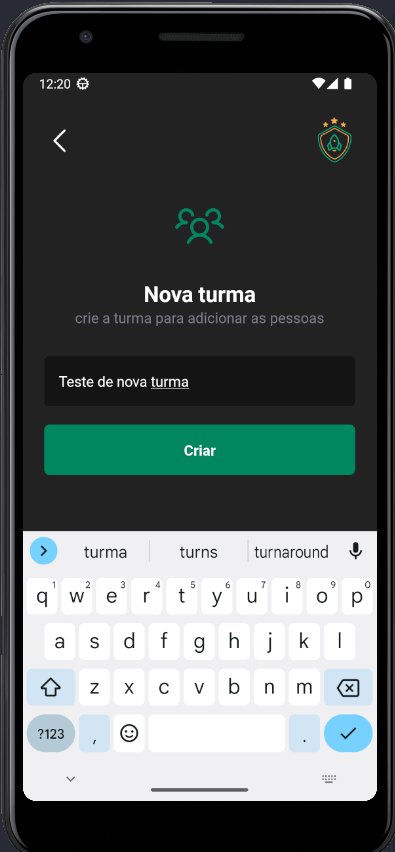

# igniteteams

## Summary

1. [Description](#description)
2. [How to start](#how-to-start)
3. [Technologies](#technologies)
4. [Screens](#screens)

## Description

Project igniteteams is a app that allows you to organize people into groups.  
You can a create a new group and delete too.  
You can add a new person into a group and delete too.  

  

## How to start

1. Clone this repo.
2. Download dependencies

> npm i

3. Start project

> npm start

4. This project use REACT version >=18
5. This project use REACT NATIVE version >=0.71
6. This project use **[Expo](https://expo.dev/)**.

     

## Technologies

- [Expo](https://docs.expo.dev/guides/authentication/#github)
- [React Native](https://reactnative.dev/)
- [Typescript](https://www.typescriptlang.org/)

    

## Screens

1- Add new group  

2-Add new person into a group 

3- Group details with participants 

